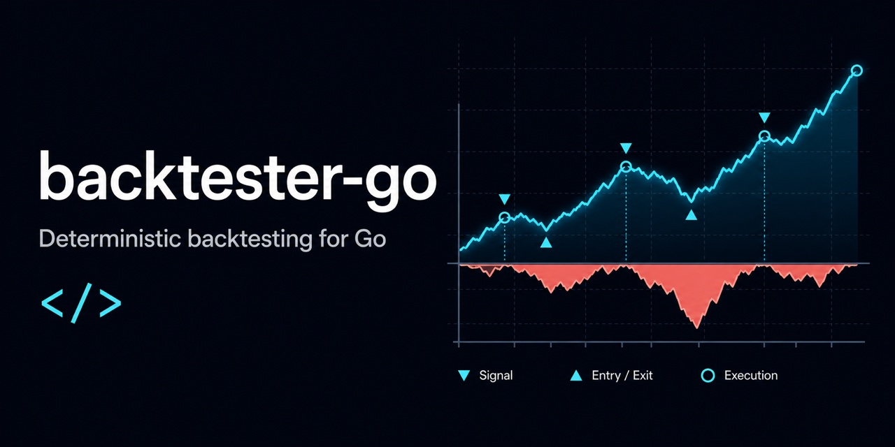

# backtester-go

A reusable Go backtesting engine that executes strategy-produced target exposures against market bars.

```sh
go get github.com/efealt/backtester-go@latest
```

Requires Go 1.22 or newer.

## Public API contract

Consumer projects provide ordered bars, timestamp-aligned target exposures, and
one explicit configuration object. Strategy signal generation and market-data
download stay outside this library.

`Run` executes one independently configured economic rule. It does not infer
candidate, benchmark, buy-and-hold, or cash semantics from the target pattern.
Every `Config` field, including `Exits`, applies to every position in that run.
When comparing multiple rules, give each run the configuration its rule is
supposed to follow. Copying a `Config` also retains its exit policies; clear
`Exits` explicitly when a baseline must not inherit strategy-specific exits.

Each `MarketBar` requires `Timestamp` and `Close`. `Open`, `High`, and `Low` may
all be omitted for a closing-price-only run; otherwise all three must form a
valid OHLC bar.

```go
package main

import (
	"fmt"
	"log"
	"time"

	"github.com/efealt/backtester-go"
)

func main() {
	start := time.Date(2025, time.January, 2, 0, 0, 0, 0, time.UTC)
	bars := []backtester.MarketBar{
		{Timestamp: start, Close: 100},
		{Timestamp: start.AddDate(0, 0, 1), Close: 110},
		{Timestamp: start.AddDate(0, 0, 2), Close: 121},
		{Timestamp: start.AddDate(0, 0, 3), Close: 121},
	}
	targets := []backtester.Target{
		{Timestamp: bars[0].Timestamp, Exposure: 1},
		{Timestamp: bars[1].Timestamp, Exposure: 1},
		{Timestamp: bars[2].Timestamp, Exposure: 0},
		{Timestamp: bars[3].Timestamp, Exposure: 0},
	}

	config := backtester.DefaultConfig()
	config.StartingCapital = 100_000
	config.ExecutionLag = 1
	config.ExecutionTiming = backtester.ExecutionAtClose

	result, err := backtester.Run(bars, targets, config)
	if err != nil {
		log.Fatal(err)
	}

	fmt.Printf("bar 1 exposure: %.0f\n", result.Path[1].ExecutedExposure)
	fmt.Printf("total return: %.2f%%\n", result.Metrics.TotalReturn*100)
	fmt.Printf("trades: %d\n", len(result.Trades))
}
```

Output:

```text
bar 1 exposure: 1
total return: 10.00%
trades: 1
```

With `ExecutionLag: 1` and `ExecutionAtClose`, the exact timeline is:

- The `2025-01-02` target is observed but not executed on that bar.
- At the `2025-01-03` close, the `2025-01-02` target executes and exposure
  becomes `1`.
- At the `2025-01-04` close, the `2025-01-03` target executes and exposure
  remains `1`; the position earned the 10% close-to-close return.
- At the `2025-01-05` close, the `2025-01-04` target executes and exposure
  becomes `0`.

`Run` returns `Result` and `error`. `Result` owns the complete path, trades,
exit events, metrics, and ruin status. Consumer projects do not implement
backtesting or accounting wrappers.

Executable package examples show rule-based, model-based, and externally
generated targets. All three call the same `Run` function directly.
`ExampleRun_independentConfigurations` shows a candidate and a constant-exposure
baseline using different exit configurations while sharing the same accounting
assumptions.

## Complete evaluation operation

Use `Run` when one set of bars, targets, and accounting assumptions is the
complete job. Use `Evaluate` when the same validated primary rule also needs an
explicit set of fixed-target references, target scales, or chronological
partitions. `Evaluate` calls the same accounting implementation as `Run`; it
does not reimplement costs, exits, trades, paths, metrics, or ruin behavior.

```go
marketConfig := config
marketConfig.InitialExposure = 1
marketConfig.Exits = backtester.ExitPolicies{}

cashConfig := config
cashConfig.InitialExposure = 0
cashConfig.Exits = backtester.ExitPolicies{}

evaluation, err := backtester.Evaluate(
	context.Background(),
	bars,
	targets,
	config,
	backtester.EvaluationSpec{
		References: &backtester.ReferenceEvaluationSpec{
			Items: []backtester.FixedTargetReference{
				{Name: "market", TargetExposure: 1, Config: marketConfig},
				{Name: "cash", TargetExposure: 0, Config: cashConfig},
			},
		},
		Scaling: &backtester.ScalingEvaluationSpec{
			Multipliers: []float64{0.5, 1, 2},
		},
		Split: &backtester.ChronologicalSplitSpec{
			FirstFraction: 0.8,
		},
		Folds: &backtester.ChronologicalFoldsSpec{
			Count: 4,
		},
	},
)
```

The full-period primary run always executes. Every `EvaluationSpec` field is
otherwise independent and opt-in: nil disables it, while non-nil requires a
complete declaration. The zero-value spec runs only the primary. Enabling one
component never enables another.

### References

`ReferenceEvaluationSpec.Items` is an ordered list of caller-named
`FixedTargetReference` values. The library creates one timestamp-aligned target
per bar at `TargetExposure`. Each reference receives its own complete `Config`;
it does not inherit or clear any primary setting. In particular, the reference
config's `InitialExposure` is held before its first delayed fixed target
executes, and its `Exits` apply normally.

Names must be non-empty, unique, and free of leading or trailing whitespace.
Target exposure must be finite. The library assigns no meaning to a name or
exposure: market, cash, benchmark, control, and any other interpretation remain
caller concepts.

### Scaling

`ScalingEvaluationSpec.Multipliers` contains ordered, unique, finite values
greater than zero. Each value creates an independent full-period run by
multiplying every primary target exposure and the primary config's
`InitialExposure`. Timestamps and every other config field remain unchanged.
The returned `ScaledResult` pairs each multiplier with its complete `Result`.
Scaling is not crossed with references, split partitions, or folds.

### Chronological split

`ChronologicalSplitSpec.FirstFraction` is a finite decimal fraction strictly
between zero and one. For `N = len(bars)-1` return intervals, the first
partition receives `floor(N * FirstFraction)` intervals and the second receives
the remainder. Both must receive at least one interval.

The first slice ends at the shared boundary bar, and the second starts at that
same bar. Therefore every return interval appears exactly once:

```text
bars:      T0  T1  T2  T3  T4  T5
first:     [-----------]
second:                [-------]
intervals:  1   2   3   4   5
```

For a `0.6` split of these five intervals, `First` uses `T0..T3`, `Second`
uses `T3..T5`, `BoundaryTimestamp` is `T3`, and
`FirstSecondIntervalEndTimestamp` is `T4`. Both partitions independently
start from each scenario's declared starting capital and initial exposure.
Position and equity state do not flow across the boundary. Each partition
contains the primary plus the same references declared for the full period.

These are evaluations of already-produced fixed targets. They do not fit,
refit, train, or validate a strategy or model, and the library does not label
either partition in-sample or out-of-sample.

### Chronological folds

`ChronologicalFoldsSpec.Count` is exact, positive, and no greater than the
number of return intervals. For zero-based fold `i`, the interval boundaries
are `first = i*N/Count` and `last = (i+1)*N/Count`; the fold runs bars and
targets `[first:last+1]`. Adjacent folds share only their boundary bar, folds
are returned in chronological order with one-based indexes, and every return
interval appears once. Each fold is an independent primary run; the library
never silently reduces the requested count or carries state between folds.

### Validation, cancellation, and results

`Evaluate` validates the primary input and every derived reference, scale, and
partition before any accounting run begins. Empty enabled components, duplicate
names or multipliers, non-finite values, invalid configs, scaling overflow,
empty split partitions, and impossible fold counts return errors without
partial results.

The context is checked after validation and before and after every constituent
run. `Run` itself remains synchronous, so cancellation observed during one run
is returned immediately after that run finishes and before another begins.

`Evaluation.FullPeriod` contains the primary `Result` and ordered named
references. Optional output fields are omitted from JSON when disabled.
`Scaling` contains independent scaled results, `Split` contains two independent
comparisons and exact interval metadata, and `Folds` contains independent
primary results. The operation contains no strategy generation, parameter
selection, market-data retrieval, persistence, presentation, or claim that a
result represents an edge.

## Configuration

All rates and exposures are decimal values unless stated otherwise.

| Field | Meaning |
| --- | --- |
| `StartingCapital` | Initial account equity in the caller's currency. |
| `InitialExposure` | Exposure held before the first target executes: `1` is fully long, `0` is flat, `-1` is fully short, and values beyond `+/-1` are leveraged. |
| `ExecutionLag` | Number of supplied bars between a target and its execution. The minimum is `1`; it is bars, not clock time. |
| `ExecutionTiming` | Execute on the selected bar's `open` or `close`. Open execution requires OHLC data; close execution also supports closing-price-only data. |
| `CommissionBPS` | Commission charged per unit of turnover, in basis points. One basis point is `0.01%`. |
| `SlippageBPS` | Slippage charged per unit of turnover, in basis points. |
| `CashAnnualRate` | Annual return on uninvested cash; `0.04` means 4% per year. |
| `FinancingAnnualRate` | Annual financing cost on exposure beyond `+/-1`; `0.06` means 6% per year. |
| `PeriodsPerYear` | Expected number of supplied bars in one year. It converts annual rates to per-bar rates and annualizes statistics. |
| `Exits` | Optional stop-loss and take-profit policies applied to every position in this run. No target pattern is automatically exempt. |

`PeriodsPerYear` must match the frequency and calendar of the supplied bars.
Common examples are:

- Monthly bars: `12`
- Weekly bars: `52`
- Daily US-market bars: `252`
- Four-hour bars in a continuously traded 24/7 market: `6 * 365` (`2190`)
- Four-hour bars in a continuously traded 24/5 market: `6 * 5 * 52` (`1560`)

For other sessions, use the number of bars the actual market calendar and data
provider produce in a typical year. The engine does not infer a timeframe from
timestamps. Bars should therefore have a consistent frequency within one run.

### Cash and financing timing

Each path point after the first contains one cash-and-financing accrual. The
engine applies that accrual to the exposure carried into the bar, before any
target or exit executes at that bar's open or close. Uninvested cash weight is
`max(1 - abs(exposure), 0)`; financed weight is
`max(abs(exposure) - 1, 0)`.

Consequently, an exposure opened on the current bar begins accruing on the next
path point. An exposure exited or reversed on the current bar receives its final
accrual on the current path point, and that financing cost belongs to the trade
that entered the bar. This convention is identical for open and close execution
and prevents terminal-bar entries from receiving a full-period financing charge.

## Result semantics

Each path point reports the target observed on the bar, exposure after the
bar's executions, representative return exposure, exact gross strategy return,
cash return, every cost, net return, dollar PnL, equity, turnover, and drawdown.
`GrossPnL` includes strategy PnL plus cash yield before costs; `NetPnL` is the
change in equity after financing and trading costs.

A trade begins when exposure moves away from zero. Same-direction resizing stays
inside that trade; flattening, reversal, an exit rule, or ruin closes it. A
terminal open trade is returned with no exit time, exit price, or exit reason.
`BarsHeld` counts distinct input bars containing a return segment attributed to
the trade. Trade PnL excludes cash yield and includes trading and financing
costs. `Trade.Return` divides net trade PnL by the account equity available when
the trade opened. For a reversal, earlier bar accounting and the closing leg's
cost are applied before the new trade's basis is recorded.

Performance metrics use consecutive equity returns:

- Annualized return is compound growth using `PeriodsPerYear`; annualized
  volatility uses sample standard deviation.
- Downside deviation is the root mean square of returns below zero over all
  observations. Sharpe and Sortino use a zero-return threshold because cash
  yield is already included in the equity path.
- Maximum drawdown is negative. Duration counts consecutive underwater
  observations. Recovery time counts observations from the worst trough back to
  its prior peak and is `-1` when unrecovered. Ulcer index is root mean square
  drawdown.
- Worst rolling 12-month return uses the nearest whole-number
  `PeriodsPerYear` window and is absent when the path is too short.
- Historical 95% VaR and expected shortfall are positive loss magnitudes from
  the worst `ceil(5% * observations)` returns, using at least one observation.
- Turnover and costs are path totals. Average exposure is mean absolute return
  exposure. Trade count includes terminal open trades; hit rate, payoff ratio,
  and profit factor use completed trades only.
- Undefined ratios, empty subsets, and zero-volatility ratios return zero. A
  ruined path ends at zero equity and reports a `-100%` total return.

## Exit behavior

Exit policies are optional and fully configured by the caller:

```go
fixedStop := 0.05
trailingStop := 0.10

config := backtester.DefaultConfig()
config.Exits = backtester.ExitPolicies{
	StopLoss: &backtester.StopLossPolicy{
		FixedPercent:              &fixedStop,
		TrailingPercent:           &trailingStop,
		Timing:                    backtester.ExitSameBar,
		TriggeredExposureFraction: 0,
		WaitForSignalChange:       true,
	},
	TakeProfit: &backtester.TakeProfitPolicy{
		Percent:                   0.20,
		Timing:                    backtester.ExitSameBar,
		TriggeredExposureFraction: 0,
		WaitForSignalChange:       true,
	},
}
```

The local `fixedStop` and `trailingStop` variables provide the pointers used by
the optional stop rules. The executable `ExampleExitPolicies` package example
runs this configuration through `Run` and verifies the emitted stop-loss rule,
fill price, and response exposure.

### Price data used by exits

Complete OHLC bars provide positive `Open`, `High`, `Low`, and `Close` prices.
`High` and `Low` determine whether an intrabar level was crossed.
`ExitSameBar` fills at the active level, or at `Open` when an existing position
gaps beyond it. `ExitNextBar` applies the response at the following bar's
`Open`.

Closing-price-only bars provide `Timestamp` and `Close` and use
`ExecutionAtClose`. Exit rules are evaluated at each observed close:
`ExitSameBar` applies at that close and `ExitNextBar` applies at the next
observed close.

Additional behavior:

- Fixed and trailing stop-loss percentages are measured from the position entry
  price and favorable price watermark, respectively.
- Take-profit percentages are measured from the position entry price.
- `TriggeredExposureFraction` is the fraction retained after an exit: `0` exits
  fully and `0.5` retains half of the current exposure. A retained exposure is
  the same position and trade: its original entry price, fixed-stop anchor, and
  take-profit anchor remain unchanged, while its trailing watermark continues
  across the partial exit. PnL and exit costs remain on that trade.
- `WaitForSignalChange` prevents the exposure that triggered an exit from being
  restored until the strategy supplies a different target exposure.
- A triggered exit response takes precedence over a strategy target scheduled
  for the same bar; without `WaitForSignalChange`, that target may restore the
  exposure on a later execution bar.
- When stop-loss and take-profit levels are both crossed in one bar, the
  stop-loss decision takes precedence.

## Features

- Ordered OHLC market bars and timestamp-aligned target exposures from any
  strategy, model, or research script.
- One complete, explicit evaluation operation for named fixed-target references,
  target scaling, chronological splits, and chronological folds.
- Closing-price-only series are also supported; intrabar and gap behavior is
  used only when OHLC data is available.
- Explicit execution lag and timing with causal signal-to-position alignment.
- Long, short, fractional, and leveraged target exposures without an arbitrary
  exposure ceiling.
- Starting-capital, cash-interest, leverage-financing, commission, and slippage
  accounting.
- Fixed and trailing stop-loss rules for long and short positions.
- Take-profit rules for long and short positions.
- Same-bar and next-bar exit responses, gap-aware fills, conservative stop-loss
  precedence when exit rules collide, partial post-exit exposure, and optional
  waiting for the strategy signal to change before re-entry.
- Position and entry-price tracking throughout the run.
- A complete per-bar PnL path containing timestamp, asset return, target and
  executed exposure, turnover, gross return, costs, net return, equity, and
  drawdown.
- A complete trade ledger containing entry, exit, exposure, PnL, costs,
  duration, and exit reason.
- Detailed stop-loss and take-profit event records containing active level,
  fill price, gap-fill status, rule collision, previous exposure, and response
  exposure.
- Ruin detection with deterministic termination of an insolvent path.
- Total and annualized return, annualized volatility, downside deviation,
  Sharpe ratio, Sortino ratio, Calmar ratio, maximum drawdown, drawdown duration,
  recovery time, ulcer index, worst rolling 12-month return, worst period
  return, 95% value at risk, 95% expected shortfall, turnover, total costs,
  average exposure, hit rate, payoff ratio, profit factor, observation count,
  and trade count.
- Deterministic results for identical bars, targets, configuration, and exit
  policies.

## License

Licensed under the [Apache License 2.0](LICENSE).
